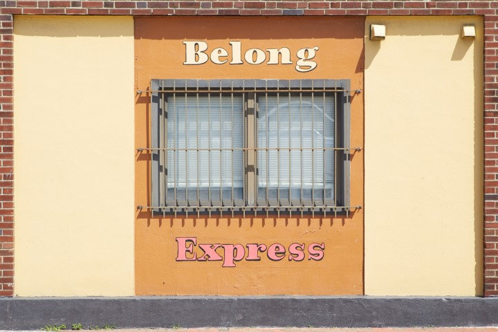
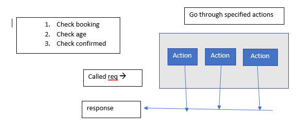

# Week Four

This week we have practiced writing functions in JavaScript. I’m not sure if I am returning a Boolean
in some of them that are meant to return a true if a truthy. It is interesting how the functions work
and trying to keep my code as clean as possible as well as using good naming conventions takes thought
as well and something I will do more research upon.

I’m most of the way through the Code Academy JavaScript tutorials but hit a roadblock with the tutorials
using Babel as the terminal kept crashing. It was a lot of information to retain and am sure using it in
a practical sense will be where most of my learning becomes solidified. Having the base to work from,
which the tutorials have provided, has been really helpful, yet can be confusing at times or maybe it
is also so much information to process I need more time to digest it.

I have arranged to meet with the business owners to draw up the wireframes for the project and
to further discuss what functionality will be required in the website. I will use A4 paper to
represent a full screen version of the website for the starting point. Then I will create versions
for mobile platforms in the appropriate sizes. There was a good tip on folding paper to get the
sizes for mobile and tablets.

I will be meeting with my tutors on Friday to discuss the suitability of my proposal for the website
project as will need to meet the brief guidelines. I can add functionality to the site that is suited to the requirements of the business – yet provides the interactive components required by the brief. As I am new to JavaScript getting my tutors input into what will be achievable in terms of functionality for the timeframe and my lack of experience using it will be very important.

Fridays class was an introduction to express.js the command statements and how Middleware, Routes and app.listen are a fundamental part of what happens.

Ali gave an analogy of a restaurant as a way for us to understand what is quite a complex series of things that happen. There is a business owner who doesn't know hoe to run the restaurant but has a purpose of wanting the restaurant to run well as a business. So he advertises for a manager who has a certain set of skills to do what he can't. This represents node not having express.js so needs to ask it to come and provide its services. You make a variable Express (an instance you can use) = require ('express') a module that can then be used to help "run the restaurant". It is a seperate framework which is downloaded using npm which gives all the functionality I need and I use the a saved keyword each time I want to use its skills or functionality. e.g. var app = express(). Now app has a list of all the functionalities and can be used over and over. {art of the functionalities are like checks or rules of who can come into the restaurant - "Do they have a booking", "is the booking confirmed" and "are they of a legal age?" This is decision making that is part of "Middleware" it includes a series of actions (can be many) that need to be done in any express app. It goes through each decision and series of actions sequentially and can't skip a step.

### Code Example:
app.use (function (req, res, next) {
        var booking = req.booking
        var age = req.age
        if (booking && age)
        next()
}
This is a block of code acting like an inspector, can proceed to next action or throw an error. It makes an instance of 'express' and throws it in the variable 'app'. It is missing a path to site or page, each page has its own express logic behind it. Needs to know where it is pointing so the code is refactored to include the specific path it si going to find and then apply these rules.

### Code Refactored to include path

app.use ('/table', (req, res, next ) --> {
    var age = req.age
    var booking = res.age
    if (age && booking) {
        next()
    }
})

## Executing routes

If the owner received a phone call from someone wanting to get a table for four --> manager needs to sort it. Express needs to find an available table for 4 and if age is checked.

### Code example

app.get('/table/:amount', function (req, res, next) {
    var dinner = req.parameters.amount
    res.send('looking for table' + dinner+ !')
})

dinner represents 4 diners which is a number
It is looking for the procedures table require in route table so is looking in route table for a suitable table for number of customers coming in. Parameter looks like this req = {
    p: {
        amount :4
    }
}

Is a request and after it gets the request will send a response as two actions are needed to be carried out.  App.use is not actually fetching data but setting up the actions or rules that need to be carried out when a response is sent with parameters.

When apps grow these rules can be and grouped together to be reused for other specific routes.

### Code example

const tableroute =
const express = req('express')
const tableRoute = express.Router()
"the http request"

table.route.use (function (req,res,next) {
    var booking = req.booking
    var age = req.age
    if (booking && age){
        next()
    }
})

If want to access that just show if add.get
Rules have no parameters and when sending a http request is booking yes, is confrimed yes, is age yes (next). If a false cycle will stop like a try and catch and a message will be returned. The rule set can be used for a bar path.

tableRoute,use ('/bar', function(req,res,next){
    var age = req.age
    if (age >= 18)}
    next()
})

Declared our rote with tableRoute.use as we require middleware, route and app.listen.
The app.listen gives our adress and availabilty. App will listen to a specified port usually 3000 which we have given as the adress.

### Code
app.listen(3000){
    console.log("running port 3000)
}

So there are four main concepts in express.js a req statement// middleware actions//routes// app.listen.

A bit confusing but I have got that the rules are something that is set like the rules on a wall on a restaurant and that then qualifies who can come in - the Middleware carries out the actions without parameters and then a response is sent with parameters to a specified route to which the rules are applied and the app.listen gives out where we are - address and that we are open!!!

I've finished the React tutorial on code academy and found it interesting as using html like statements but not html and self enclosing tags have to have a / and classes have to be capitalised  which can have javascript within them. Loads of things and concepts and can see its usefulness and why react is so popular as you can apply so much to be rendered on webpages easily and it can all be reused.
I have also redone my journal entries as md files so they can have some formatting and images - not as fast as a blog but way better than a text file as I absolutely did not like writing up text in that way, was difficult and hard to see what I was writing and keep up the flow of writing my ideas. 

